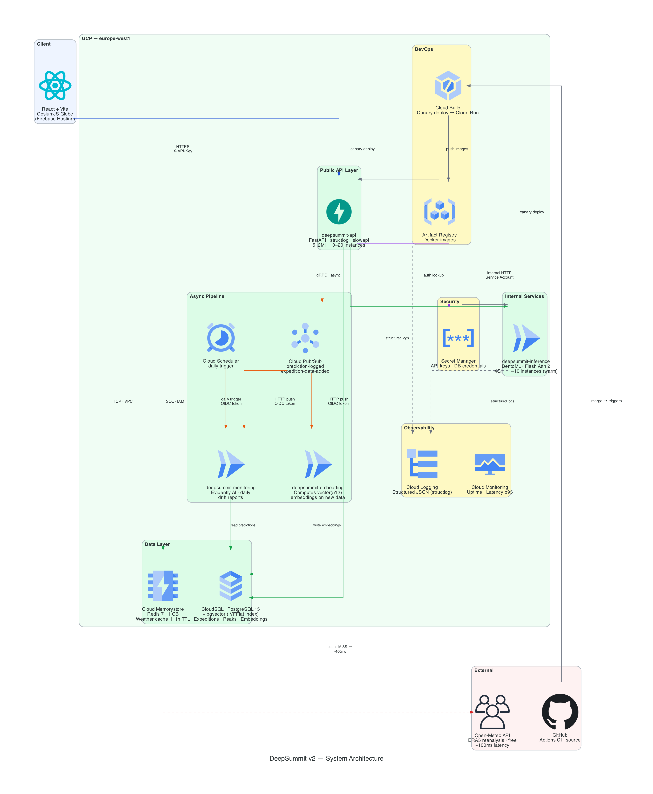
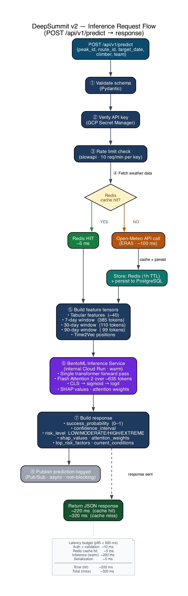
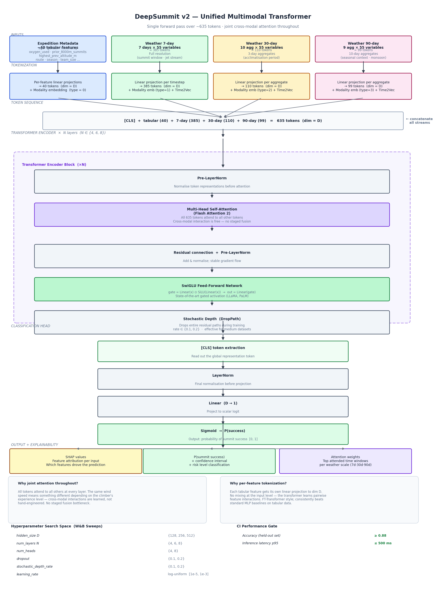
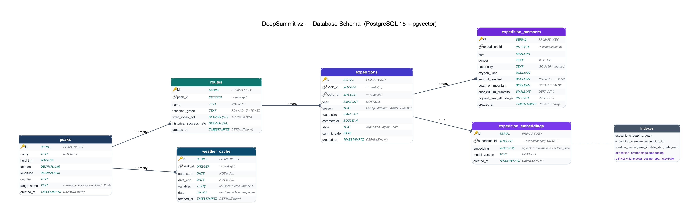
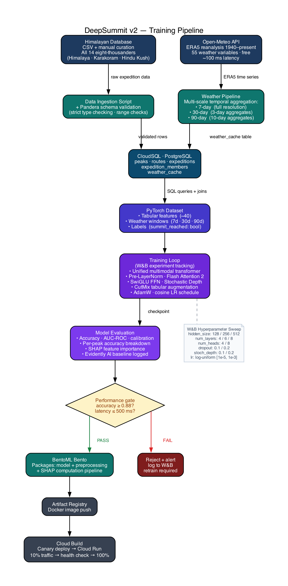

# DeepSummit

**Mountaineering expedition success prediction for all 14 eight-thousanders.**

DeepSummit uses a unified multimodal transformer to estimate the probability of a summit attempt succeeding, combining expedition metadata with multi-scale historical weather data from ERA5 reanalysis (via Open-Meteo). The result is served through an interactive 3D globe interface built with CesiumJS.

---

## System Architecture

DeepSummit runs on GCP Cloud Run with serverless inference, PostgreSQL + pgvector for data storage, Redis for weather caching, and Pub/Sub for event-driven workflows.

---

## What It Does

You select a peak on the globe, choose a route and target date, fill in your team and personal climbing profile, and receive:

- **Success probability** — calibrated 0–100% estimate
- **Risk level** — LOW / MODERATE / HIGH / EXTREME classification
- **Top risk factors** — the features pushing the prediction in either direction
- **Weather context** — current and forecasted conditions at the summit
- **SHAP explanations** — how each input feature contributed to the prediction
- **Attention heatmap** — which time windows in the weather history the model focused on

### Inference Flow

Each prediction request flows through validation, rate limiting, weather cache (Redis → Open-Meteo if miss), feature tensor construction, model inference (BentoML), and SHAP/attention extraction—all in under 500ms.

---

## Peaks Covered

All 14 eight-thousanders across three ranges:

| Range | Peaks |
|-------|-------|
| Himalaya | Everest, K2, Kangchenjunga, Lhotse, Makalu, Cho Oyu, Dhaulagiri, Manaslu, Nanga Parbat, Annapurna, Shishapangma |
| Karakoram | K2, Broad Peak, Gasherbrum I, Gasherbrum II |
| Hindu Kush | Tirich Mir |

> Data sourced from the Himalayan Database, extended and manually curated to cover all ranges.

---

## Key Features

- **Sub-second inference** — weather data pre-cached in Redis; no API calls at prediction time
- **Multi-scale weather** — the model sees 7-day, 30-day, and 90-day weather windows simultaneously, capturing summit windows, acclimatization context, and seasonal patterns
- **Explainability** — SHAP feature importance and attention weight visualization are first-class outputs, not afterthoughts
- **3D globe UI** — real Himalayan terrain via CesiumJS with fly-to animations and peak selection
- **Model monitoring** — Evidently AI drift reports run on a daily schedule; W&B tracks all experiments

---

## Model Architecture

The core ML system uses a single unified transformer that jointly attends over ~635 tokens: tabular expedition features (per-feature tokenization) and multi-scale weather sequences (7-day, 30-day, 90-day windows). Flash Attention 2 enables efficient cross-modal attention, with SHAP and attention weights extracted for explainability.

---

## Tech Stack

| Layer | Technology |
|-------|------------|
| Frontend | React + TypeScript (Vite), CesiumJS / resium, Tailwind CSS, shadcn/ui, Recharts |
| API | FastAPI, structlog, slowapi |
| ML model | PyTorch, Flash Attention 2, BentoML |
| Experiment tracking | Weights & Biases |
| Data validation | Pandera |
| Model monitoring | Evidently AI |
| Database | PostgreSQL + pgvector (CloudSQL) |
| ORM | SQLModel |
| Cache | Redis (Cloud Memorystore) |
| Weather data | Open-Meteo (ERA5, free, ~100ms) |
| Infrastructure | GCP Cloud Run, Pub/Sub, Secret Manager, Artifact Registry |
| CI/CD | GitHub Actions, Cloud Build |

### Database Schema

PostgreSQL with pgvector extension stores peaks, routes, expeditions, expedition members, weather cache, and expedition embeddings. Relational structure enables efficient queries while pgvector supports similarity search for "find similar expeditions" features.

See [architecture.md](architecture.md) for the full system design and rationale behind these choices.

---

## Background

DeepSummit v1 was a bachelor's thesis achieving ~90% accuracy on Himalayan expedition success prediction using a dual-transformer architecture (SAINT for tabular data + Stormer for ERA5 meteorological data). v2 rebuilds this into a production system:

| v1 | v2 |
|----|-----|
| 8 Nepalese peaks | All 14 eight-thousanders |
| 30–60 min inference (direct ERA5 downloads) | Sub-second (Open-Meteo + Redis cache) |
| Dual-transformer, separate forward passes | Single unified transformer, joint attention |
| No UI | React + CesiumJS 3D globe |
| Local only | GCP Cloud Run, CI/CD, monitoring |

### Training Pipeline

Data flows from the Himalayan Database and Open-Meteo API through Pandera validation into CloudSQL. The PyTorch training loop uses W&B for experiment tracking, with hyperparameter sweeps searching over model dimensions, attention heads, and regularization. Models passing the performance gate (≥88% accuracy, ≤500ms latency) are packaged with BentoML and deployed via Cloud Build.

---

## Setup

> **Coming soon.** Setup and local development instructions will be added as the project stabilises. Check back or watch the repository for updates.

---

## Usage

> **Coming soon.** Usage documentation and a live demo link will be added when the first deployment is ready.

---

## Architecture

See [architecture.md](architecture.md) for:
- System component diagram
- Inference data flow
- ML model design
- Key architectural decisions and their rationale

---

## License

MIT
